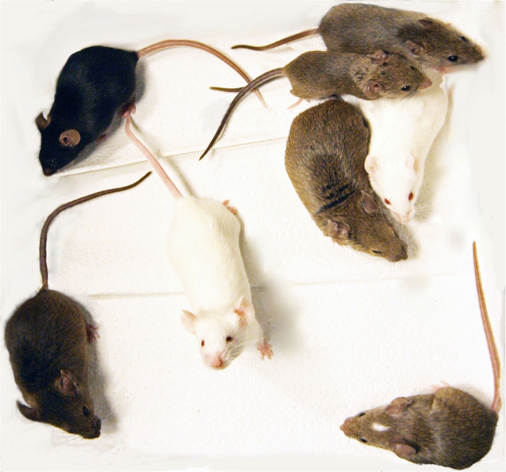
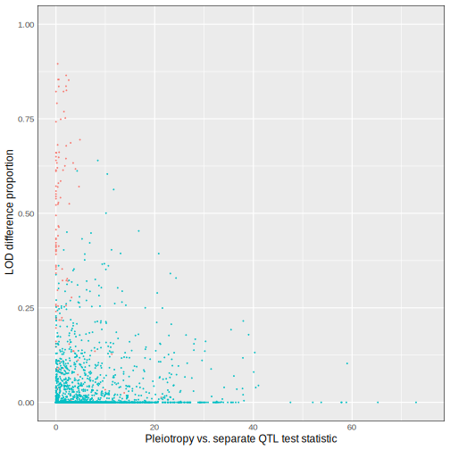
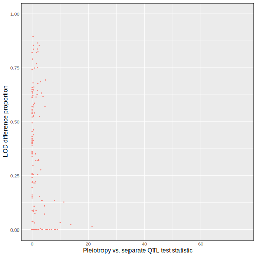
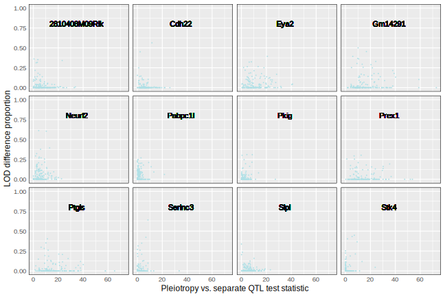

```{r setup, include=FALSE}
options(htmltools.dir.version = FALSE)
library(knitr)
ratio <- "4:3"
fig_height <- ifelse(ratio=='4:3', 10, 7.5)
fig_width <- 15
curves_height <- ifelse(ratio=='4:3', 580, 540)
curves_width <- ifelse(ratio=='4:3', 800, 1080)
knitr::opts_chunk$set(#dev="svg", 
                      echo=FALSE, 
                      #results="hide",
                      #fig.height=fig_height,
                      #fig.width=fig_width,
                      warning=FALSE, message=FALSE)
xaringan::summon_remark() # download latest version, locally
```


```{r, load_refs, echo=FALSE, cache=FALSE}
library(RefManageR)
BibOptions(check.entries = FALSE, 
           bib.style = "authoryear", 
           cite.style = 'authoryear', 
           style = "markdown",
           hyperlink = FALSE, 
           dashed = FALSE, 
           longnamesfirst = FALSE,
           max.names = 2,
           bibpunct = c(" (", ") ", ",", ",", " and ", " "))
myBib <- ReadBib("./research.bib", check = FALSE)
```


```{r xaringan-themer, include = FALSE}
library(xaringanthemer)
#mono_light(
#  base_color = "#1c5253",
#  header_font_google = google_font("Josefin Sans"),
#  text_font_google   = google_font("Montserrat", "300", #"300i"),
#  code_font_google   = google_font("Droid Mono")
#)
solarized_light()
```


# Introduction

- 10,000+ traits with RNA sequencing and mass spectrometry 

- Multiparental populations offer high-resolution QTL mapping

- New analysis tools, such as a pleiotropy test for multiparental populations, are needed 


???

- Together, high-dimensional traits and multiparental populations can inform complex trait genetics


---

# `r Citet(myBib, "jiang1995multiple")` test

- Two-parent crosses    

- Applies to two traits that co-map     

- $H_0$: Pleiotropy    

- $H_A$: Two separate QTL    


---

# `r Citet(myBib, "jiang1995multiple")` test


- Perform a two-dimensional QTL scan     

- $Y = XB + E$     

- Calculate likelihood ratio test statistic     

???

- 2d scan involves all ordered pairs of markers


---

# `r Citet(myBib, "jiang1995multiple")` test

```{r}
library(tidyverse)
library(ggalt) #contains geom_encircle
```

```{r}
# two-dimensional grid for pleiotropy testing
c1 <- c(rep(1:5, each = 5), 1:5)
c2 <- c(rep(1:5, times = 5), 1:5)
foo <- c(rep(2, 25), rep(1, 5))

tibble(c1, c2, foo = as.factor(foo)) %>%
  ggplot() + geom_encircle(aes(x = c1, 
                               y = c2, 
                               color = foo, 
                               #fill = foo, 
                               #alpha = 0.1
                               ), 
                           s_shape = 0, spread = 0.01, expand = 0.05
                           ) + 
  geom_point(aes(x = c1, y = c2, color = foo)) + 
  xlim(c(0, 6)) + ylim(c(0, 6)) + xlab("trait1 position") + 
  ylab("trait2 position") + 
  theme(legend.position = "none")

```

---

# Multiparental populations

```{r, echo = FALSE, out.width = "700px", fig.height=fig_height, fig.width = fig_width}
source("R/hs_fig.R")
# https://github.com/kbroman/Talk_JAX2018/blob/master/R/hs_fig.R
```


---

# Challenges in multiparental populations

- Complex patterns of relatedness    

- Multiple founder lines

- Determining statistical significance    


---

# Challenges in multiparental populations

- Complex patterns of relatedness    

.soln[Multivariate random effects]

- Multiple founder lines

.soln[Fixed effect for each founder allele]    

- Determining statistical significance    

.soln[Parametric bootstrap]    


---

# Test procedure

- Model: $$vec(Y) = Xvec(B) + vec(G) + vec(E)$$ 
    
- Calculate likelihoods

???

- $G$: Polygenic random effects   
    
- $E$: Random errors
    


---

# Test procedure

- Test statistic: $$- \log \frac{\max (\text{likelihood under pleiotropy})}{\max (\text{likelihood for separate QTL})}$$    

- Parametric bootstrap to get p-value    


---

# Test characteristics

```{r}
include_graphics("figs/power-curves.svg")
```


---

# Diversity Outbred Mice

- Multiparental population arising from 8 inbred lines    

  

```{r, echo = FALSE, out.width = "300px"}

```

???

  - Complementary to Collaborative Cross  


---

# Application

- `r Citet(myBib, c("logan2013high", "recla2014precise"), .opts = list(max.names = 1))` studied 261 Diversity Outbred mice    

- Two traits map to Chr 8:

    - "hot plate latency" (57 cM)    

    - "percent time in light" (55 cM)

???

Do they share a single QTL? 

---

# QTL scan results

```{r, out.height = "500px"}
include_graphics("figs/genomewide_lods_10-22.svg")
```

---

# Allele effects plots  


```{r, echo = FALSE, out.width = "500px"}
include_graphics("figs/coefs.svg")
```


---

# Profile LOD plot

```{r, echo = FALSE}
include_graphics("figs/profile.svg", auto_pdf = FALSE)
```


---

# Test results

- p = 0.11 (1000 bootstrap samples)


---

# Conclusions

- Weak evidence for two separate QTL

    - One QTL affects "distance traveled in light"    
    
    - Second QTL affects "hot plate latency"


---

class: center, middle, inverse, title-slide

# Mediation analysis and pleiotropy testing


---

# Mediation analysis

- Is one molecule an intermediate in a causal pathway?  

---

# Mediation analysis example 

- QTL near Dhtkd1 gene affects Dhtkd1 RNA levels and DHTKD1 protein levels

- Is Dhtkd1 RNA an intermediate between QTL and DHTKD1 protein levels? 


```{r}
include_graphics("figs/central_dogma-Dhtkd1.svg")
```

---

# Mediation analysis methods

- LOD score with and without conditioning on candidate intermediate

- LOD difference   

- LOD difference proportion    


---

# Dissecting an eQTL hotspot

- `r Citet(myBib, "keller2018genetic", .opts = list(max.names = 1))` identified 147 nonlocal traits that map to Chr 2 (163.5 Mb to 167.5 Mb)  
 
- *Hnf4a* expression levels mediate 88 of 147 traits  

- Do other local genes act as intermediates? 


???

- 378 DO mice  

---

# Dissecting an eQTL hotspot

- 13 local gene expression traits as candidate mediators

- 147 nonlocal gene expression traits

- Pair one local trait with one nonlocal trait


---

# Dissecting an eQTL hotspot

```{r, out.width=500}

```


---

# Dissecting an eQTL hotspot

```{r, out.width=500}

```


---

# Dissecting an eQTL hotspot


```{r}

```

---

# Dissecting an eQTL hotspot

```{r, out.width=500}

```


---

class: center, middle, inverse, title-slide

# qtl2pleio R package development


---

# Design elements

- Written mostly in R    
  
  - Some calculations in C++, via Rcpp package  
  
  - C++ Eigen library and RcppEigen for matrix algebra  
  
  - User interacts only with R functions  

---

# Design elements

- Tutorial vignettes demonstrate functionality  

- Unit tests included via `testthat` R package  

- Documentation with `roxygen2` R package

- Package website with `pkgdown` R package

---

# R packages book

- Hadley Wickham's "R packages" book as a guide  

```{r, out.width = "300px"}
include_graphics("figs/rpackages-cover.png")
```


---

# Open-source R package

- Hosted on github  

- Install via `devtools` R package  

- `git` commits publicly visible  

- Travis CI for testing after every commit  


---

# Binder integration

- Enhances reproducibility  

- Uses Docker images 

- Downloads R packages for a specified date (or `git` commit on Github)  


---

# Binder integration: 2 new files

- install.R

    - contains code to install R packages

- runtime.txt

    - contains one line of text to indicate date for CRAN packages
    


---

# Future directions


---

# Contact information

- frederick.boehm@gmail.com   

- https://fboehm.us/     

- qtl2pleio R package: [https://github.com/fboehm/qtl2pleio](https://github.com/fboehm/qtl2pleio)

- Biorxiv pre-print: [http://bit.ly/boehm-biorxiv](http://bit.ly/boehm-biorxiv)


---

# References

```{r, results = 'asis'}
PrintBibliography(myBib, .opts = list(style = "markdown"), start = 1, end = 3)
```

---

# References

```{r, results = 'asis'}
PrintBibliography(myBib, .opts = list(style = "markdown"), start = 4, end = 6)
```

